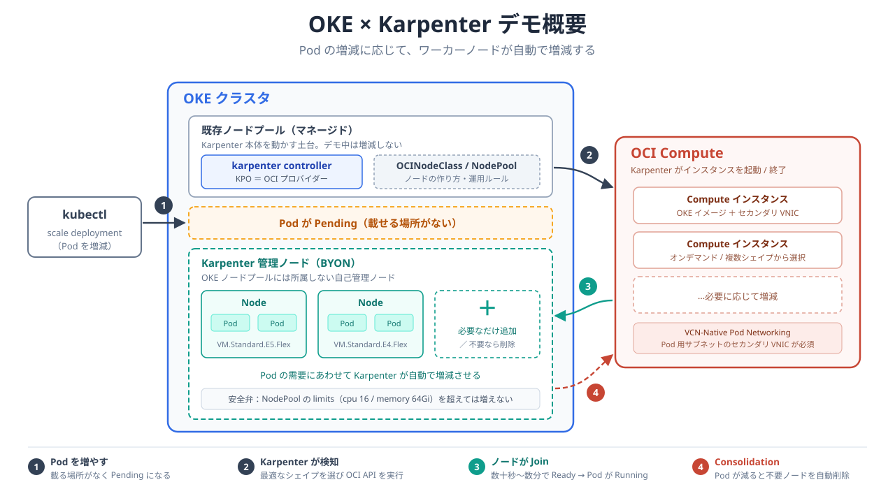

# OKE × Karpenter 初心者向けデモ

Oracle Cloud Infrastructure (OCI) の Kubernetes サービス **OKE (Kubernetes Engine)** 上で、
**Karpenter Provider for OCI (KPO)** を使ったノードオートスケーリングを体験する、初心者向けのハンズオン／デモ用リポジトリです。

## デモ概要



> 図：[docs/images/demo-overview.svg](docs/images/demo-overview.svg)（1280×720 / 16:9・スライド貼り付け可）

## このデモで学べること

- Karpenter とは何か / 従来の Cluster Autoscaler と何が違うのか
- OKE に KPO をインストールする流れ
- Pod を増やすと **数十秒〜数分でノードが自動追加** される様子（スケールアウト）
- Pod を減らすと **不要なノードが自動削除・統合(Consolidation)** される様子（スケールイン）

## 前提知識

`kubectl` で Pod / Deployment を操作した経験があれば OK です。
Karpenter・OKE の知識は不要で、このシナリオを上から順に進めれば動きます。

## シナリオ（この順に進めます）

| No. | ドキュメント | 内容 |
| --- | --- | --- |
| 0 | [docs/00-overview.md](docs/00-overview.md) | Karpenter とは / アーキテクチャ / 用語 |
| 1 | [docs/01-prerequisites.md](docs/01-prerequisites.md) | 事前準備（OKE クラスタ・ツール・IAM ポリシー） |
| 2 | [docs/02-install-kpo.md](docs/02-install-kpo.md) | Helm で KPO をインストール |
| 3 | [docs/03-nodepool.md](docs/03-nodepool.md) | OCINodeClass / NodePool を作成 |
| 4 | [docs/04-demo-scaleout.md](docs/04-demo-scaleout.md) | 【デモ①】Pod を増やしてノード自動追加 |
| 5 | [docs/05-demo-consolidation.md](docs/05-demo-consolidation.md) | 【デモ②】Pod を減らしてノード自動削除・統合 |
| 6 | [docs/06-cleanup.md](docs/06-cleanup.md) | 後片付け |
| - | [docs/90-ca-vs-karpenter.md](docs/90-ca-vs-karpenter.md) | 【参考】Cluster Autoscaler との詳細比較・選択の目安 |
| - | [docs/99-troubleshooting.md](docs/99-troubleshooting.md) | よくあるハマりどころ |

## ディレクトリ構成

```
karpenter-demo/
├── README.md
├── docs/          … シナリオ本文（00〜99）
└── manifests/     … kubectl apply するサンプル YAML
    ├── ocinodeclass.yaml
    ├── nodepool.yaml
    └── inflate.yaml
```

## 所要時間の目安

- 事前準備（OKE 作成・IAM）：既存クラスタがあれば 15 分程度
- KPO インストール〜NodePool 作成：15 分程度
- デモ①②の実演：10〜15 分程度

## 前提環境

本デモは **OCI VCN-Native Pod Networking** のクラスタを前提にしています。
（Flannel クラスタの場合の差分は [docs/03-nodepool.md](docs/03-nodepool.md) 末尾に記載）

**最初に必ず** 自分のクラスタの CNI を確認してください。ここを間違えるとノードが NotReady のままになります。

```bash
kubectl get ds -n kube-system
```

`vcn-native-ip-cni` があれば VCN-Native、`kube-flannel-ds` があれば Flannel です。

> **Note**
> 本リポジトリの YAML 中の `<...>` は環境固有の値（OCID など）のプレースホルダーです。
> ご自身の環境の値に置き換えてください。置き換え箇所は [docs/01-prerequisites.md](docs/01-prerequisites.md) にまとめています。
